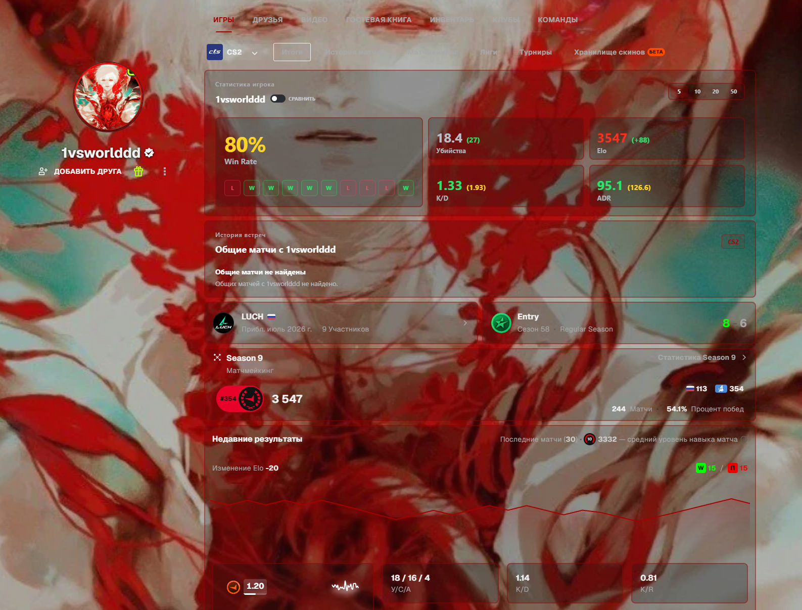
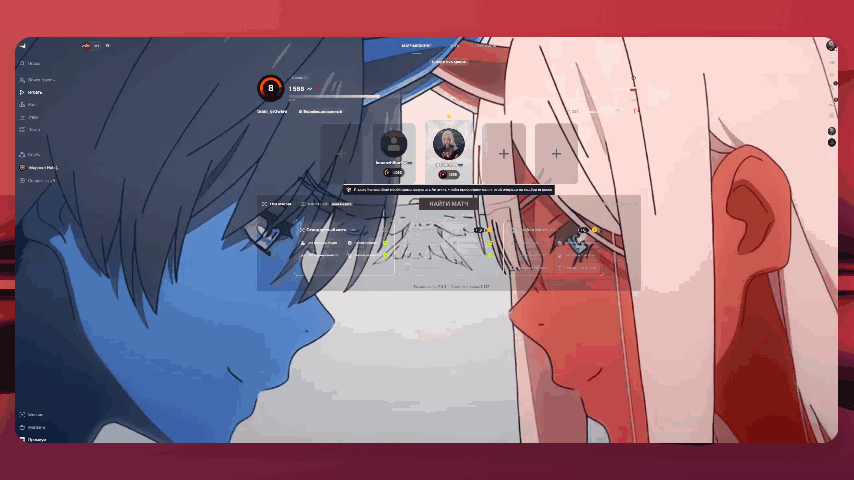

  

  <a href="#русский">Русский</a> · <a href="#english">English</a>

## Русский

### FACEIT Absolute — свой фон и оформление профиля

Хочешь поставить фон на Фейсит и настроить профиль под себя? **FACEIT Absolute** — независимое расширение для браузера: свой фон, библиотека готовых изображений, прозрачность панелей, обводки и дополнительные данные FACEIT CS2.

**[Установить в Chrome](https://chromewebstore.google.com/detail/faceit-absolute/immjippehkkpphboodnbbchgmpabmpec)** · **[Установить в Firefox](https://addons.mozilla.org/en-US/firefox/addon/faceit-absolute/)** · **[Скачать ZIP для своего браузера](https://github.com/growlee/FACEIT-Absolute/releases/latest)**

[Все способы установки](#установка) · [Библиотека фонов](https://faceit.eelworg.ru/profile-library/) · [Сайт проекта](https://faceit.eelworg.ru/)

### Настрой FACEIT под себя

| Возможность            | Что можно сделать                                                  |
| ---------------------- | ------------------------------------------------------------------ |
| Свой фон профиля       | Загрузить изображение и настроить оформление вокруг него.          |
| Библиотека фонов       | Найти готовый фон, посмотреть превью и применить через расширение. |
| Прозрачность и обводки | Настроить панели, цвет и толщину обводки под выбранный фон.        |
| Нужные блоки           | Скрыть лишние разделы профиля.                                     |
| Статистика FACEIT CS2  | Посмотреть дополнительные данные игроков, матчей и совместных игр. |

### Библиотека профилей

Открой [библиотеку](https://faceit.eelworg.ru/profile-library/), посмотри превью и выбери готовый фон для своего профиля.

### Ещё один пример оформления

Изображения и анимации показывают реальные примеры оформления профиля. Набор доступных функций зависит от версии расширения; отдельные возможности требуют подключения FACEIT или Absolute Premium. Условия показаны внутри расширения.

### Установка

| Браузер        | Рекомендуемый способ                                                                                                                                         |
| -------------- | ------------------------------------------------------------------------------------------------------------------------------------------------------------ |
| Google Chrome  | [Chrome Web Store](https://chromewebstore.google.com/detail/faceit-absolute/immjippehkkpphboodnbbchgmpabmpec)                                                |
| Firefox        | [Firefox Add-ons](https://addons.mozilla.org/en-US/firefox/addon/faceit-absolute/)                                                                           |
| Microsoft Edge | Установка из Chrome Web Store или ZIP для Edge из [релиза](https://github.com/growlee/FACEIT-Absolute/releases/latest).                                      |
| Opera          | Установка из Chrome Web Store, если поддерживается вашей версией, или ZIP для Opera из [релиза](https://github.com/growlee/FACEIT-Absolute/releases/latest). |

Установка выполняется на компьютере. Версии в магазинах и на GitHub могут отличаться.

### Ручная установка в Chrome, Edge или Opera

1. Открой [последний релиз](https://github.com/growlee/FACEIT-Absolute/releases/latest) и скачай ZIP для своего браузера.
2. Распакуй архив в отдельную папку.
3. Открой страницу расширений: `chrome://extensions`, `edge://extensions` или `opera://extensions`.
4. Включи режим разработчика и выбери «Загрузить распакованное расширение» / «Load unpacked».
5. Укажи папку, в которой находится `manifest.json`.

Для Firefox используй магазин дополнений. ZIP Firefox в GitHub-релизах не подписан Mozilla и не предназначен для постоянной установки в обычный Firefox; он доступен для тестирования и ручной загрузки в магазин.

### Как поставить фон на Фейсит

1. Установи FACEIT Absolute и открой свой профиль на FACEIT.
2. Открой расширение и подключи свой аккаунт FACEIT для функций оформления.
3. Выбери фон в [библиотеке](https://faceit.eelworg.ru/profile-library/) или загрузи своё изображение через настройки оформления профиля.
4. Настрой прозрачность, обводки и нужные блоки, затем сохрани изменения.

При замене фона из библиотеки проверь превью: применение заменяет текущий фон и его настройки после подтверждения. Фон не меняет статистику игрока или результаты матчей.

### Вопросы

**Увидят ли мой фон другие игроки?**

Расширение оформляет страницу FACEIT в браузере. Для отображения оформления нужен FACEIT Absolute; обычная страница без расширения не получает эти изменения автоматически.

**Это официальное расширение FACEIT?**

Нет. FACEIT Absolute — независимый проект, не связанный с FACEIT. FACEIT и другие названия принадлежат их владельцам.

**Как обновить ручную установку?**

Скачай ZIP для того же браузера, распакуй в прежнюю папку расширения и нажми «Обновить» на странице расширений. Не удаляй расширение перед обновлением, если хочешь сохранить его локальные настройки.

**Где исходный код?**

Этот публичный репозиторий содержит документацию и готовые релизы. Исходный код и серверная часть хранятся отдельно в приватном репозитории.

### Поддержка и приватность

- [Поддержка в Telegram](https://t.me/faceitabsolutesupport_bot)
- [Сообщить об ошибке или предложить улучшение](https://github.com/growlee/FACEIT-Absolute/issues)
- [Действующая политика приватности](https://faceit.eelworg.ru/privacy)
- [Все релизы и контрольные суммы](https://github.com/growlee/FACEIT-Absolute/releases)

Не публикуй в Issues пароли, токены, cookies и другие личные данные. Для приватного обращения используй поддержку.

---

## English

### FACEIT Absolute — custom FACEIT profile backgrounds

Want to change your FACEIT profile background and make the page your own? **FACEIT Absolute** is an independent browser extension with custom backgrounds, a background library, panel transparency, outlines, and additional FACEIT CS2 data.

**[Install in Chrome](https://chromewebstore.google.com/detail/faceit-absolute/immjippehkkpphboodnbbchgmpabmpec)** · **[Install in Firefox](https://addons.mozilla.org/en-US/firefox/addon/faceit-absolute/)** · **[Download a ZIP for your browser](https://github.com/growlee/FACEIT-Absolute/releases/latest)**

[All installation methods](#installation) · [Background library](https://faceit.eelworg.ru/profile-library/) · [Project website](https://faceit.eelworg.ru/)

### Make FACEIT your own

| Feature                   | What you can do                                                               |
| ------------------------- | ----------------------------------------------------------------------------- |
| Custom profile background | Upload an image and customize the layout around it.                           |
| Background library        | Find a ready-made background, preview it, and apply it through the extension. |
| Transparency and outlines | Adjust panels, outline colors, and thickness to suit your background.         |
| Profile sections          | Hide sections you do not need.                                                |
| FACEIT CS2 statistics     | View additional player, match, and shared-match information.                  |

### Profile library

Open the [library](https://faceit.eelworg.ru/profile-library/), preview the styles, and choose a ready-made background for your profile.

### Another profile style

The images and animations show real profile customization examples. Available features depend on the extension version; some require a connected FACEIT account or Absolute Premium. Requirements are shown inside the extension.

### Installation

| Browser        | Recommended method                                                                                                                                                      |
| -------------- | ----------------------------------------------------------------------------------------------------------------------------------------------------------------------- |
| Google Chrome  | [Chrome Web Store](https://chromewebstore.google.com/detail/faceit-absolute/immjippehkkpphboodnbbchgmpabmpec)                                                           |
| Firefox        | [Firefox Add-ons](https://addons.mozilla.org/en-US/firefox/addon/faceit-absolute/)                                                                                      |
| Microsoft Edge | Install from Chrome Web Store or use the Edge ZIP from the [latest release](https://github.com/growlee/FACEIT-Absolute/releases/latest).                                |
| Opera          | Install from Chrome Web Store if supported by your version, or use the Opera ZIP from the [latest release](https://github.com/growlee/FACEIT-Absolute/releases/latest). |

Install on a desktop computer. Browser-store versions may differ from GitHub releases.

### Manual installation in Chrome, Edge, or Opera

1. Open the [latest release](https://github.com/growlee/FACEIT-Absolute/releases/latest) and download the ZIP for your browser.
2. Extract the archive into a separate folder.
3. Open the extensions page: `chrome://extensions`, `edge://extensions`, or `opera://extensions`.
4. Enable developer mode and select **Load unpacked**.
5. Select the folder containing `manifest.json`.

For Firefox, use Firefox Add-ons. The Firefox ZIP in GitHub releases is unsigned and cannot be permanently installed in standard Firefox; it is provided for testing and manual store submission.

### How to change your FACEIT background

1. Install FACEIT Absolute and open your own FACEIT profile.
2. Open the extension and connect your FACEIT account to use profile customization.
3. Choose a background from the [library](https://faceit.eelworg.ru/profile-library/) or upload an image through the profile customization settings.
4. Adjust transparency, outlines, and visible sections, then save your changes.

Check the preview when choosing a library background: applying it replaces your current background and its settings after confirmation. Background customization does not change player statistics or match results.

### Questions

**Can other players see my background?**

The extension changes how FACEIT pages appear in the browser. FACEIT Absolute is required to display this customization; a browser without the extension does not automatically receive these changes.

**Is this an official FACEIT extension?**

No. FACEIT Absolute is an independent project and is not affiliated with FACEIT. FACEIT and other names belong to their respective owners.

**How do I update a manual installation?**

Download the ZIP for the same browser, extract it into your existing extension folder, and click **Reload** on the extensions page. Keep the extension installed if you want to preserve its local settings.

**Where is the source code?**

This public repository contains documentation and release packages. Source code and server components are kept in a separate private repository.

### Support and privacy

- [Telegram support](https://t.me/faceitabsolutesupport_bot)
- [Report a bug or suggest an improvement](https://github.com/growlee/FACEIT-Absolute/issues)
- [Current privacy policy](https://faceit.eelworg.ru/privacy)
- [All releases and checksums](https://github.com/growlee/FACEIT-Absolute/releases)

Do not post passwords, tokens, cookies, or other private data in Issues. Contact support for private requests.
