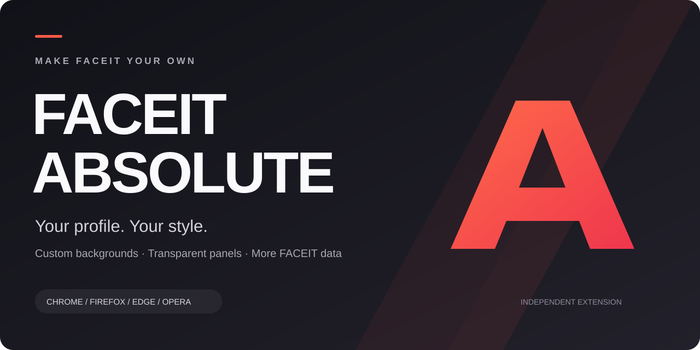
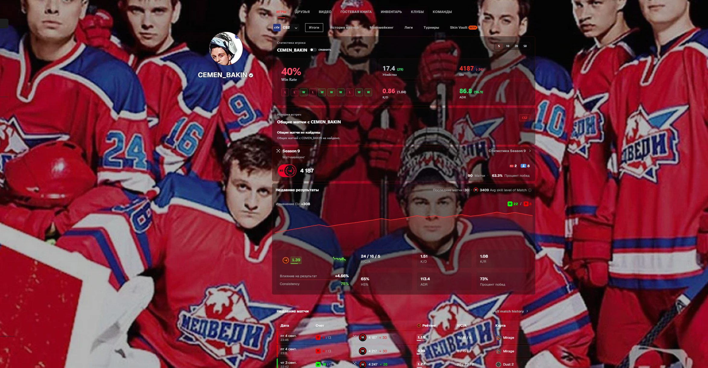

  

  <strong>Русский</strong> · <a href="README.en.md">English</a>

# FACEIT Absolute — свой фон и оформление профиля FACEIT

Хочешь поставить фон на Фейсит и настроить профиль под себя? **FACEIT Absolute** — независимое расширение для браузера: свой фон, библиотека готовых изображений, прозрачность панелей, обводки и дополнительные данные FACEIT CS2.

**[Установить расширение](#установка)** · **[Библиотека фонов](https://faceit.eelworg.ru/profile-library/)** · **[Скачать последний релиз](https://github.com/growlee/FACEIT-Absolute/releases/latest)** · **[Сайт проекта](https://faceit.eelworg.ru/)**

## Настрой FACEIT под себя

| Возможность            | Что можно сделать                                                  |
| ---------------------- | ------------------------------------------------------------------ |
| Свой фон профиля       | Загрузить изображение и настроить оформление вокруг него.          |
| Библиотека фонов       | Найти готовый фон, посмотреть превью и применить через расширение. |
| Прозрачность и обводки | Настроить панели, цвет и толщину обводки под выбранный фон.        |
| Нужные блоки           | Скрыть лишние разделы профиля.                                     |
| Статистика FACEIT CS2  | Посмотреть дополнительные данные игроков, матчей и совместных игр. |

Ещё один пример оформления

Скриншоты показывают реальные примеры оформления профиля. Набор доступных функций зависит от версии расширения; отдельные возможности требуют подключения FACEIT или Absolute Premium. Условия показаны внутри расширения.

## Установка

| Браузер        | Рекомендуемый способ                                                                                                                                         |
| -------------- | ------------------------------------------------------------------------------------------------------------------------------------------------------------ |
| Google Chrome  | [Chrome Web Store](https://chromewebstore.google.com/detail/faceit-absolute/immjippehkkpphboodnbbchgmpabmpec)                                                |
| Firefox        | [Firefox Add-ons](https://addons.mozilla.org/en-US/firefox/addon/faceit-absolute/)                                                                           |
| Microsoft Edge | Установка из Chrome Web Store или ZIP для Edge из [релиза](https://github.com/growlee/FACEIT-Absolute/releases/latest).                                      |
| Opera          | Установка из Chrome Web Store, если поддерживается вашей версией, или ZIP для Opera из [релиза](https://github.com/growlee/FACEIT-Absolute/releases/latest). |

Установка выполняется на компьютере. Версии в магазинах и на GitHub могут отличаться.

### Ручная установка в Chrome, Edge или Opera

1. Открой [последний релиз](https://github.com/growlee/FACEIT-Absolute/releases/latest) и скачай ZIP для своего браузера.
2. Распакуй архив в отдельную папку.
3. Открой страницу расширений: `chrome://extensions`, `edge://extensions` или `opera://extensions`.
4. Включи режим разработчика и выбери «Загрузить распакованное расширение» / «Load unpacked».
5. Укажи папку, в которой находится `manifest.json`.

Для Firefox используй магазин дополнений. ZIP Firefox в GitHub-релизах не подписан Mozilla и не предназначен для постоянной установки в обычный Firefox; он доступен для тестирования и ручной загрузки в магазин.

## Как поставить фон на Фейсит

1. Установи FACEIT Absolute и открой свой профиль на FACEIT.
2. Открой расширение и подключи свой аккаунт FACEIT для функций оформления.
3. Выбери фон в [библиотеке](https://faceit.eelworg.ru/profile-library/) или загрузи своё изображение через настройки оформления профиля.
4. Настрой прозрачность, обводки и нужные блоки, затем сохрани изменения.

При замене фона из библиотеки проверь превью: применение заменяет текущий фон и его настройки после подтверждения. Фон не меняет статистику игрока или результаты матчей.

## Вопросы

**Увидят ли мой фон другие игроки?**

Расширение оформляет страницу FACEIT в браузере. Для отображения оформления нужен FACEIT Absolute; обычная страница без расширения не получает эти изменения автоматически.

**Это официальное расширение FACEIT?**

Нет. FACEIT Absolute — независимый проект, не связанный с FACEIT. FACEIT и другие названия принадлежат их владельцам.

**Как обновить ручную установку?**

Скачай ZIP для того же браузера, распакуй в прежнюю папку расширения и нажми «Обновить» на странице расширений. Не удаляй расширение перед обновлением, если хочешь сохранить его локальные настройки.

**Где исходный код?**

Этот публичный репозиторий содержит документацию и готовые релизы. Исходный код и серверная часть хранятся отдельно в приватном репозитории.

## Поддержка и приватность

- [Поддержка в Telegram](https://t.me/faceitabsolutesupport_bot)
- [Сообщить об ошибке или предложить улучшение](https://github.com/growlee/FACEIT-Absolute/issues)
- [Действующая политика приватности](https://eelworg.ru/privacy/faceit-absolute/)
- [Перенесённые материалы политики приватности](privacy/README.md)
- [Все релизы и контрольные суммы](https://github.com/growlee/FACEIT-Absolute/releases)

Не публикуй в Issues пароли, токены, cookies и другие личные данные. Для приватного обращения используй поддержку.
